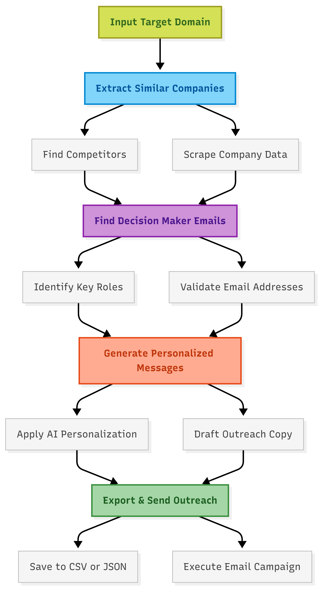

# OutreachPilot

**Automated B2B Outreach Pipeline** — Enter a company domain, get personalized outreach at scale.

OutreachPilot automates the full outreach workflow: discovering similar companies, finding decision makers, resolving verified emails, and generating personalized outreach — all from a single domain input.

---

## Architecture & Workflow



### How It Works

```text
Domain Input → Similar Companies → Decision Makers → Verified Emails → Personalized Outreach
   (User)         (Ocean.io)          (Prospeo)      (Prospeo/Eazyreach)      (Brevo)
```

---

## Quick Start

### Prerequisites

- Python 3.11+
- API keys for **Ocean.io**, **Prospeo**, **Eazyreach**, and **Brevo**

### Installation

```bash
# Clone the repository
git clone <repo-url>
cd outreachpilot

# Create virtual environment
python -m venv venv
venv\Scripts\activate  # Windows
# source venv/bin/activate  # macOS/Linux

# Install dependencies
pip install -r requirements.txt
```

### Configuration

```bash
# Copy the example environment file
cp .env.example .env
```

**Required API Keys in `.env`:**

| Service | Variable | Purpose |
|---|---|---|
| Ocean.io | `OCEAN_API_KEY` | Company lookalike search |
| Prospeo | `PROSPEO_API_KEY` | Contact discovery & email |
| Eazyreach | `EAZYREACH_API_KEY` / `EAZYREACH_TOKEN` | Email verification |
| Brevo | `BREVO_API_KEY` | Transactional email sending |

---

## Usage

### CLI Mode (Primary)
```bash
python main.py
```

**With Options:**
```bash
python main.py --domain notion.so --dry-run --export csv
```

### Web Dashboard
```bash
python main.py --dashboard
# Open http://localhost:8000
```

---

## Project Structure

```text
project/
├── app/
│   ├── api/                 # REST API endpoints
│   ├── config/              # Settings & logging
│   ├── dashboard/           # FastAPI web interface
│   ├── models/              # Pydantic data models
│   ├── services/            # Business logic & API clients
│   ├── templates/           # Jinja2 HTML templates
│   ├── static/              # CSS, assets
│   └── data/                # Run history persistence
├── tests/                   # Pytest test suite
├── logs/                    # Structured log files
├── exports/                 # CSV/JSON export output
├── main.py                  # CLI entry point
├── .env                     # Environment configuration
└── requirements.txt         # Python dependencies
```

---

## Engineering Decisions

### Why This Architecture?
**Service-oriented with clear boundaries.** Each external API has its own service class inheriting from `BaseService`.
- Swapping an API provider requires changing one file.
- Each service can be tested independently.
- Rate limits and retries are configured per-service.

### Resiliency (Retries & Rate Limits)
The `BaseService` class implements **exponential backoff**:
- Attempts retry on 429, 500, 502, 503, 504 errors.
- Honors `Retry-After` header dynamically.
- Each API client manages its own rate independently.

### How Email Safety Works
1. **No automatic sending** — Explicit user approval required.
2. **Dry run mode** — Full pipeline simulation without sending.
3. **Email preview** — Review every message before sending.
4. **Safety checkpoint** — Displays counts and requires confirmation.
5. **Brevo sandbox** — Supports `X-Sib-Sandbox: drop` header for testing.

---

## Advanced Settings

See `.env.example` for the full list. Key settings include:

| Variable | Default | Description |
|----------|---------|-------------|
| `MAX_RETRIES` | `3` | API retry attempts |
| `RETRY_BACKOFF_FACTOR` | `2` | Exponential backoff multiplier |
| `RATE_LIMIT_DELAY` | `1.0` | Delay between API calls |
| `MAX_COMPANIES` | `50` | Max companies to discover |
| `MAX_CONTACTS_PER_COMPANY` | `10` | Max contacts per company |

---

## Testing
```bash
pytest tests/ -v
```

## License
MIT
